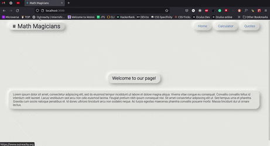

# Math Magicians

> **Math Magicians** is an SPA made for all fans of maths. It contains a calculator that allows the users to make the majority of arithmetic operations. In additions, it displays a random math related quote in each session.
> It is built using React.js

## Built With

- React (CRA)

## Milestones

- [x] Milestone 1: **Project setup**
- [x] Milestone 2: **Components**
- [x] Milestone 3: **Events**
- [x] Milestone 4: **Full website**
- [x] Milestone 5: **Tests**
- [x] Milestone 6: **Deploy**

## sneak peek

## Getting Started

**Prerequisites:** A Web Browser (preferably FireFox or Chrome)
To get a local copy up and running follow these simple example steps.

### **Option 1**

#### Use the live Website

[Math Magicians Website (Netlify)](https://deploy-preview-7--monumental-caramel-f6ef58.netlify.app/)

[Math Magicians Website (Heroku)](https://aqueous-woodland-09440.herokuapp.com/)

### **Option 2**

#### Set up your own copy locally

- Clone [the GitHub Repository](https://github.com/Sboursen/math-magicians.git)
- Go to the Project `cd math-magicians`
- Run `npm install` to install the _dependencies_
- Run `npm start` to run the live server.

#### (Optional) Run tests

- Stop the server if it's already running `CTRL` + `C`
- Run `npm test` run the tests

## About me

👤 **Soufiane Boursen**

- GitHub: [@Sboursen](https://github.com/Sboursen)
- Twitter: [@sboursen_dev](https://twitter.com/sboursen_dev)
- LinkedIn: [@sboursen](https://linkedin.com/in/sboursen)

## Contributors

> A huge thanks to these people for collaborating with me on the project:

👤 **Souad**

- GitHub: [@souad988](https://github.com/souad988)

Contributions, issues, and feature requests are welcome!

Feel free to check the [issues page](../../issues/).

## Show your support

Give a ⭐️ if you like this project!

## 📝 License

This project is under the [MIT](./LICENSE) license.
